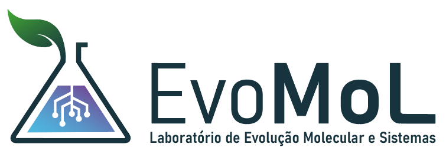
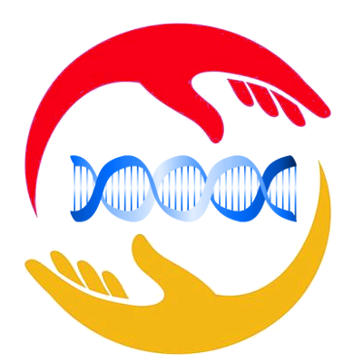
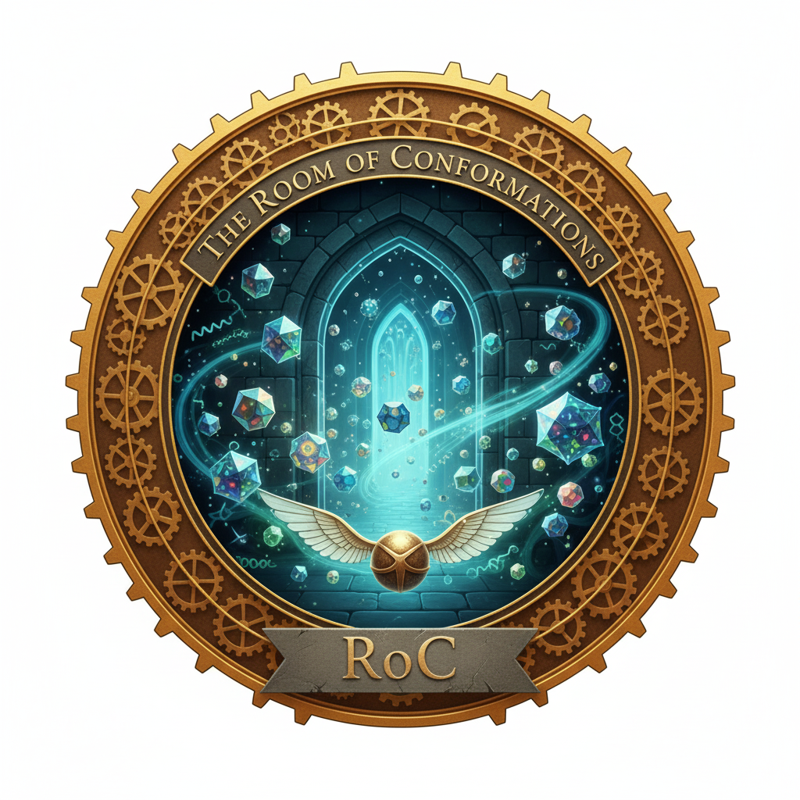
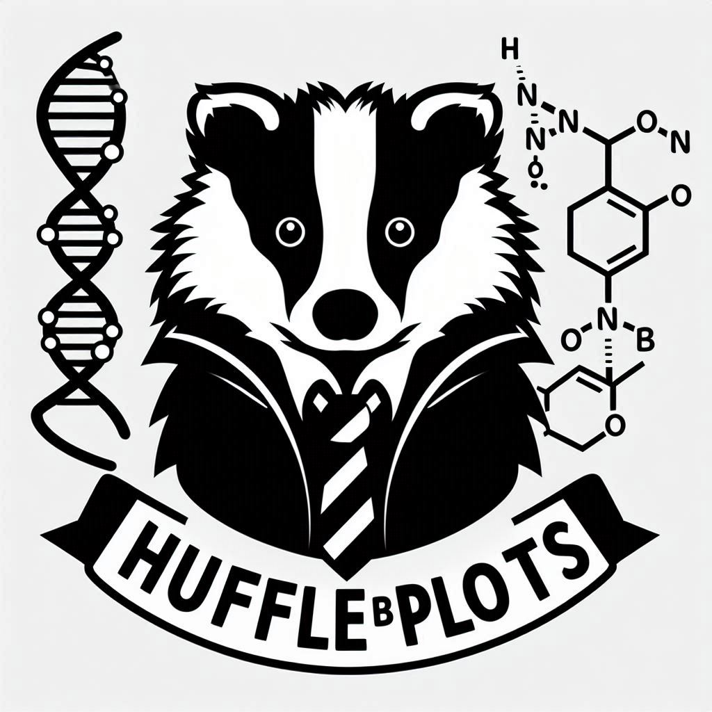
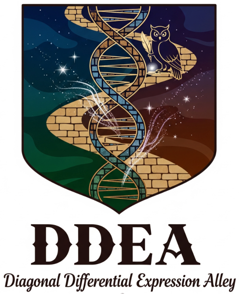
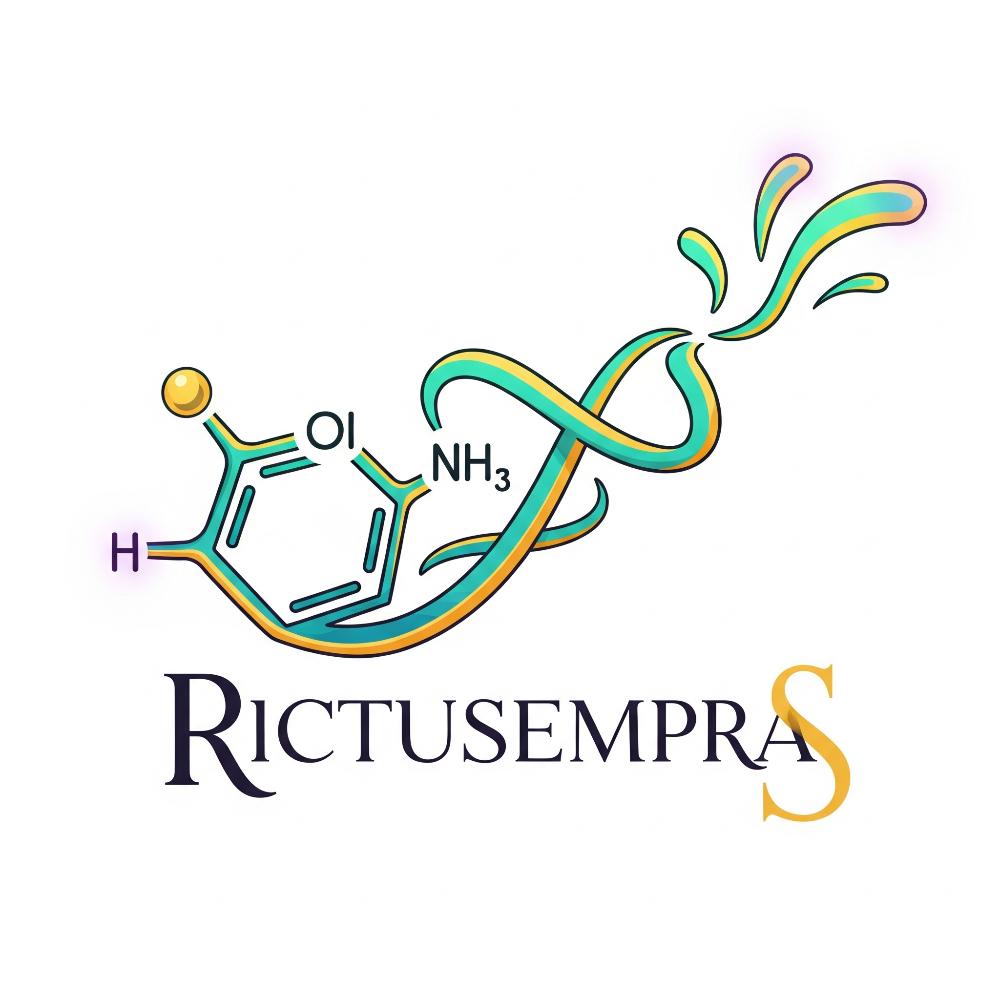
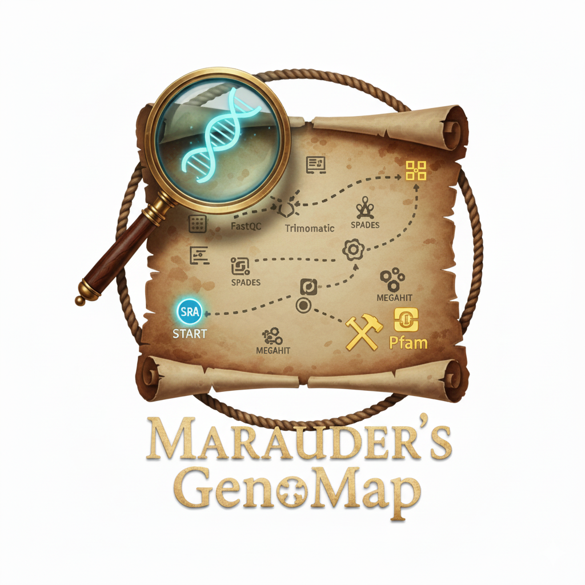
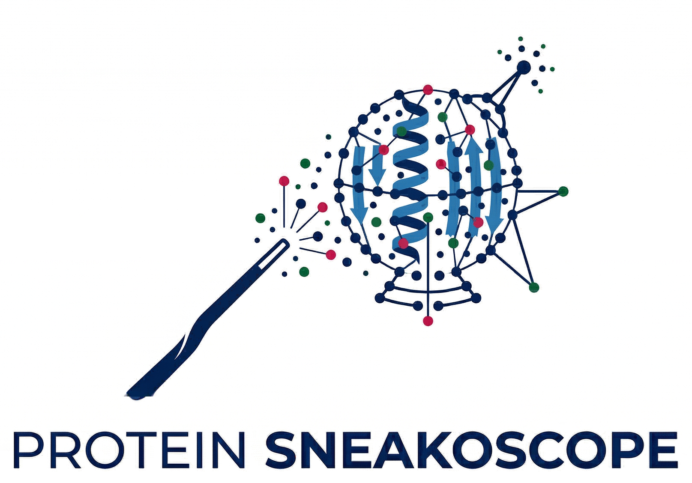
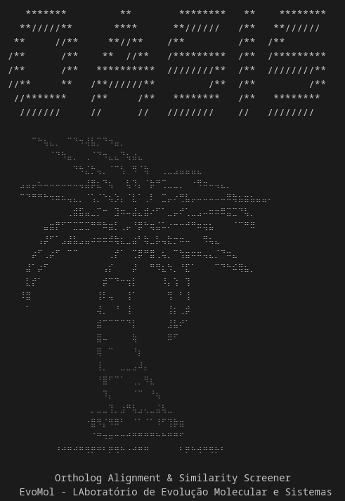
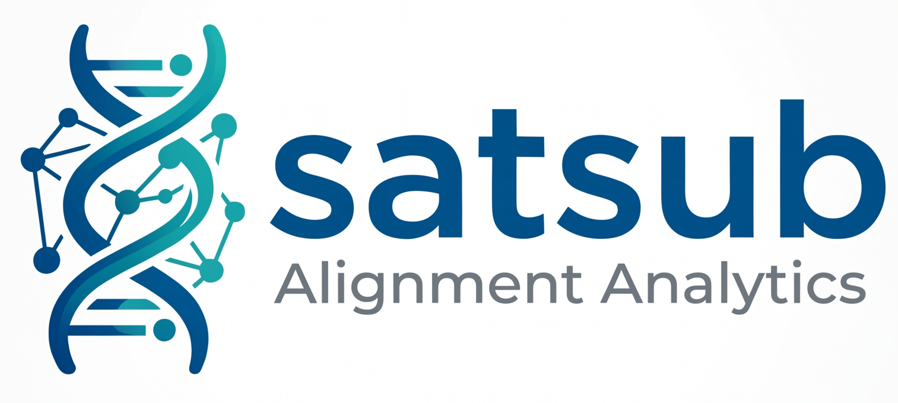

## 

## EvoMol-Lab

The Laboratory of Evolution of Molecules and Systems (EvoMol-Lab) is one of the research groups associated with the [Bioinformatics Multidisciplinary Environment (BioME)](https://bioinfo.imd.ufrn.br), at the [Metrópole Digital Institute (IMD)](https://imd.ufrn.br) of the Federal University of Rio Grande do Norte ([UFRN](https://ufrn.br)).

EvoMol-Lab's mission is to study evolutionary processes that act on molecules, supramolecular complexes, and systems (pathways and interaction networks) and the structural and functional effects caused by genetic variation, using approaches from Bioinformatics, molecular modeling, and evolutionary sequence analysis.

### PT-Br

O Laboratório de Evolução de Moléculas e Sistemas (EvoMol-Lab) é um dos grupos de pesquisa associados ao [Centro Multiusuário de Bioinformática (BioME)](http://biome.ufrn.br), do [Instituto Metrópole Digital (IMD)](http://imd.ufrn.br) da Universidade Federal do Rio Grande do Norte ([UFRN](http://ufrn.br)). O EvoMol-Lab tem como missão estudar processos evolutivos que atuam em moléculas, complexos supramoleculares e sistemas (vias e redes de interação) e os efeitos estruturais e funcionais provocados pela variação genética, utilizando abordagens da Bioinformática, modelagem molecular e análise evolucionária de sequências. Seu Principal Investigador é o Prof. João Paulo MS Lima, Professor Titular da UFRN.

## Our tutorials page:

[Tutoriais BioinfoX](https://jpmslima.github.io)

## Our tools:

"EvoMol-Lab has a series of ***"magic"*** tools to help you with your work and analyses.

---

### CaRinDB

CaRinDB is an interactive database designed to streamline cancer mutation research by integrating data from The Cancer Genome Atlas (TCGA) and advanced structural analysis tools, along with advanced effect predictions and molecular features such as Residue Interaction Networks (RINs) derived from Protein Data Bank experimental structures and AlphaFoldDB computational models. Covering 33 distinct cancer types, CaRinDB offers a broad spectrum of insights into cancer mutation dynamics.

[Go to CaRinDB](https://bioinfo.imd.ufrn.br/CaRinDB/)
[CaRinDB's Publication](https://academic.oup.com/bioinformaticsadvances/article/6/1/vbaf313/8440752)

---

### SlyTheRINs

SlytheRINs is an interactive Python web application built with Streamlit, designed to analyze and compare protein Residue Interaction Networks (RINs). These graphs represent the amino acid residues as the nodes and their chemical interactions as the edges. They can be easily generated from a single or multiple protein structures, using computational modeling methods, normal-based mode, or molecular dynamics simulation. SlytheRINs provides an analysis dashboard to explore and compare network parameters, identify significant residue-level changes across different conformations, analyze chemical interaction types, and integrate these findings with predicted mutation effects from AlphaMissense (in the case of human proteins).

[Go to SlyTheRins](https://slytherins.streamlit.app)
[SlyTheRINs preprint](https://www.biorxiv.org/content/10.64898/2026.02.26.708270v1)

---

### The Room of Conformations (RoC)

A user-friendly desktop tool for generating all-atom protein conformational ensembles using Normal Mode Analysis.

[Go to RoC (GitHub)](https://github.com/evomol-lab/RoC)
[Go to RoC (Google Colab)](https://colab.research.google.com/drive/1jd3qgAZPF9bWxlcCjYURpFQAEYW102Y5?usp=sharing)

---

### Sauron (yes, it is from the Lord of the Rings!)

Sauron is a Residue Interaction Network (RIN) Calculator that identifies and maps intra-molecular interactions in protein structures. It analyzes PDB and MMCIF files to calculate interactions such as hydrogen bonds, salt bridges, disulfide bonds, and van der Waals contacts, outputting node and edge files perfectly suited for network analysis.

[Sauron's GitHub](https://github.com/evomol-lab/Sauron)

---

### RevelioPlots

RevelioPlots is an interactive web application designed for the quality assessment of protein structure models. By parsing Crystallographic Information Files (.cif or .mmcif), the app provides a suite of intuitive visualizations centered around the per-residue Local Distance Difference Test (pLDDT) score, a key metric for model confidence, particularly in structures generated by tools like AlphaFold.

[Go to RevelioPlots (App)](https://revelioplots.streamlit.app)
[Go to RevelioPlots (GitHub)](https://github.com/jpmslima/RevelioPlots)
[RevelioPlots preprint](https://www.biorxiv.org/content/10.64898/2026.02.23.707401v1)

---

### HufflePlots

HufflePlots is a simple and interactive tool to visualize, analyze and compare RMSD and RMSF plots of protein structural trajectories data from Molecular Dynamics or Normal mode-based geometric simulations.

[Go to HufflePlots](https://protplots.streamlit.app)

---

### Lumos Networks

Lumos Networks is a modular Python web application designed to bridge the gap between raw transcriptomic data and systems biology insights. Developed at EvoMol-Lab (UFRN), the suite provides a streamlined workflow for Differential Expression Analysis, Functional Enrichment, and Knowledge-based Network construction.

[Go to Lumos Networks](https://lumos-networks.streamlit.app/)
[Lumos Networks' GitHub](https://github.com/evomol-lab/lumos-networks)

---

### Differential Expression Diagonal Alley (DDEA)

DDEA is a simple Streamlit application to analyze Case x Control gene expression output data from GEO. Allows users to upload a .tsv file, a custom gene list (optional), and specify a comparison string, with controls in a sidebar. DDEA then plots differentially expressed genes using Plotly and displays their p-values.

[Go to DDEA](https://ddealley.streamlit.app/)
[DDEA's GitHub](https://github.com/evomol-lab/DDEA)

---

### Rictusempra

Rictusempra is a web-based cheminformatics tool for interactively visualizing small molecules and calculating their most likely protonation state at a given physiological pH. It provides a simple interface to generate 2D and 3D molecular structures and prepare them for further computational chemistry tasks like molecular docking or simulation.

[Go to Rictusempra](https://rictusempra.streamlit.app)
[Rictusempra's GitHub](https://github.com/evomol-lab/rictusempra)

---

### Marauder's GenoMap

A comprehensive pipeline for the discovery of protein families in de novo assembled genomes and transcriptomes.

[Go to Marauder's GenoMap (GitHub)](https://github.com/evomol-lab/MaraudersGenoMap)

---

### Protein Sneakoscope

Protein Sneakoscope is a comprehensive Streamlit-based web application designed for protein variant analysis, pathogenicity prediction, and 3D structural modeling. It integrates data from UniProt, AlphaMissense, and SWISS-MODEL to provide an interactive dashboard for researchers to explore how specific mutations might affect protein structure and function.

[Go to Protein Sneakoscope (GitHub)](https://github.com/jpmslima/Sneakoscope)
[Go to Protein Sneakoscope (App)](https://protein-sneakoscope.streamlit.app)

---

### OASIS (Ortholog Alignment & Similarity Screener)

OASIS is a robust, interactive command-line pipeline designed for bioinformatics researchers to effortlessly fetch, align, and strictly filter orthologous sequences from NCBI.

[Go to OASIS (GitHub)](https://github.com/RodrigoOrvate/OASIS)

---

### SatSub

SatSub is an interactive Streamlit app for exploring multiple sequence alignments and diagnosing substitution saturation. It reports nucleotide and amino-acid statistics, codon usage and RSCU, and JC69/K80/TN93/GTR saturation plots to help you decide which codon positions and models are still trustworthy for phylogenetic inference.

[Go to SatSub](https://satsub.streamlit.app/)

---

### The Pensieve Plotter

An interactive tool for visualizing Extended Bayesian Skyline Plots (EBSP) from BEAST log files.

[Go to The Pensieve Plotter](https://pensieveplotter.streamlit.app/)
