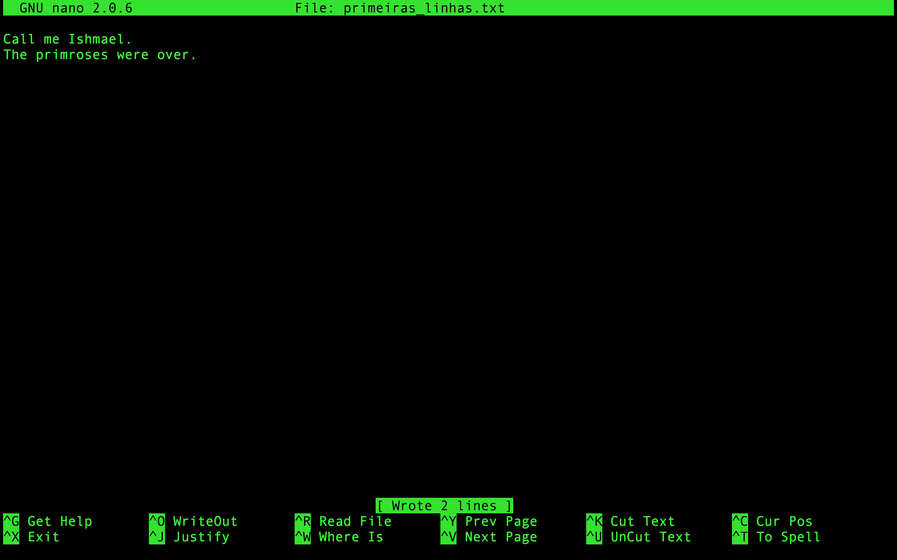

# Introducción a la línea de comandos - UNIX

***Observaciones:***

- Este tutorial fue adaptado a partir del Libro *The Biostars Handbook* (Istvan Albert, 2022) y del [*Command-line Bootcamp*](http://korflab.ucdavis.edu/bootcamp.html) por Keith Bradnam y está licenciado a través de la [Creative Commons Attribution 4.0 International License](https://creativecommons.org/licenses/by/4.0/). El contenido original fue traducido y modificado en parte de su estructura ***solo con fines didácticos***. <span style="color:red">**Su reproducción para cualquier otro fin no está permitida ni consentida.**</span>
- El usuario de cada estudiante para el acceso al servidor tiene restricciones y la dirección IP de cada acceso es registrada. Tenga mucho cuidado al usarlo.

## Cómo acceder a la línea de comandos:

### Opción recomendada para práctica durante el curso: GoogleColab

Los pasos a continuación y muchos otros se pueden realizar utilizando GoogleColab, en la siguiente dirección:

[Introducción a CLI-Colab](https://colab.research.google.com/drive/1mhX_2Ua3aqJeCzIpiUtrcHcYwjHQDPbD?usp=sharing)

El Notebook completamente ejecutado se puede verificar en:

[CLI-Colab](https://jpmslima.github.io/CLI-Colab/)

### En su máquina personal con Windows 10/11:

Hay un *bash* (con un subsistema de Ubuntu) solo a partir de Windows 10 (si desea utilizar su computadora personal). Si desea aventurarse a habilitarlo, siga [ESTOS PASOS](https://www.howtogeek.com/249966/how-to-install-and-use-the-linux-bash-shell-on-windows-10/) o busque en Google cómo proceder.

En caso de utilizar el subsistema anterior, no es necesario acceder a un servidor para practicar, solo para verificar los archivos solicitados.

### En Máquinas Linux/MacOS:

En máquinas Linux y Mac, simplemente abra el programa Terminal. No es necesario el acceso a un servidor para practicar.

### Acceder a la Terminal vía *Web* o Chromebooks:

> *Para prácticas sin acceso a un servidor*

#### Opción 1:

Para usar la terminal vía *web* utilizaremos [COCALC](https://cocalc.com/doc/terminal.html). Al acceder a la página, haga clic en el botón verde `Run Terminal Now`.

En Cocalc podrá ejecutar los comandos directamente, sin necesidad de acceso al servidor para practicar, solo para verificar los archivos solicitados.

#### Opción 2:

Para probar la terminal Linux vaya a la siguiente dirección:

[JSLinux](https://bellard.org/jslinux/)

y haga clic en: `Alpine Linux - Console`

> *Ambas opciones de terminal web pueden presentar algunas limitaciones en la ejecución de este tutorial.*

## Primeros pasos en la Terminal:

- Abra una terminal o *shell*. Los ejemplos a continuación pueden variar según el tipo de shell que se esté utilizando, pero los resultados serán los mismos.
- Cuando la terminal esté abierta se verá una pantalla como la de abajo:

```shell
Welcome to Ubuntu 20.04.4 LTS (GNU/Linux 5.4.0-107-generic x86_64)

 * Documentation:  https://help.ubuntu.com
 * Management:     https://landscape.canonical.com
 * Support:        https://ubuntu.com/advantage

  System information as of Wed 06 Apr 2022 02:38:23 PM -03

  System load:  0.06               Processes:             166
  Usage of /:   16.5% of 18.32GB   Users logged in:       1
  Memory usage: 1%                 IPv4 address for eth0: 10.7.41.67
  Swap usage:   0%

0 updates can be applied immediately.

Last login: Wed Apr  6 14:35:24 2022
johndoe@bioinfo:~$
```

> *La pantalla no es exactamente igual a esta, pero muy similar.*

- El primer paso que se debe dar es crear un directorio ``teste`` , usando el siguiente comando (el cual se detallará después):

```shell
mkdir teste
```

- Después de crear el directorio, ingrese y haga el resto de este y el otro tutorial (102) dentro de él. Usted ingresa a este directorio utilizando el siguiente comando:

```shell
cd teste
```

- Identifique el nombre de la máquina en la que está trabajando/accediendo, y el nombre de usuario.
- Observe el símbolo ```$```. Denota el fin de la línea de comandos prompt. Cuando no hay nada después de él, significa que la máquina está lista para la siguiente instrucción. En los ejemplos a continuación, el ```$``` no se incluirá, para que los comandos puedan copiarse y pegarse. Sin embargo, recomendamos que los comandos se escriban para que se familiarice y gane rapidez con ellos.
- Primer comando:

```shell
echo 'Hello World!'
```

- El resultado del comando debería ser algo como:

```shell
mcb:~ bioinfo$ echo 'Hello World!'
Hello World!
```

**Consejo**: *Habrá situaciones donde trabajar con múltiples terminales al mismo tiempo será extremadamente útil.*

> **Importante:** El sistema UNIX es *case sensitive*, es decir, diferencia letras mayúsculas de minúsculas en todos sus comandos, nombres de archivos y de directorios.

- Es importante resaltar que usted siempre estará dentro de un único directorio cuando esté usando la terminal. El comportamiento predeterminado es que cada vez que abra una nueva ventana de terminal, inicie en su propio directorio *home* (que puede modificar nativamente).
- Para verificar los archivos y directorios que están en el directorio *home* usaremos el siguiente comando:

```shell
ls
```

- Este dará el siguiente resultado (y claro, depende de la computadora que utilice):

```shell
Applications Desktop Documents Downloads
```

- La salida del comando ```ls``` muestra directorios y archivos. Los directorios que aparecen estarán de acuerdo con el contenido de este tutorial.
- Después del comando ```ls```, aparecerá un nuevo prompt de comando **$**, mostrando que la máquina está lista para recibir el próximo comando.
- Aunque siempre esté en un único directorio, el comando ```ls``` se utiliza para listar el contenido de cualquier directorio presente en la máquina. Intente el siguiente comando:

```shell
ls /bin  
```

- Esto mostrará en pantalla (lo que llamamos *print*) varios nombres de programas, entre ellos:

```shell
bash pwd mv
```

- Al principio, mirar los directorios desde una terminal Unix puede ser confuso. Pero estos son los exactos tipos de carpetas que usted ve cuando utiliza cualquier explorador de archivos en interfaces gráficas. A partir del nivel root (```/```) existen innumerables directorios, por lo que lo tratará como cualquier otro directorio, con el siguiente comando:

```shell
ls /
```

lo cual retornará algo como:

```shell
bin   dev   initrd.img      lib64       mnt   root  software  tmp  vmlinuz
boot  etc   initrd.img.old  lost+found  opt   run   srv       usr  vmlinuz.old
data  home  lib             media       proc  sbin  sys       var
```

- La salida se puede observar en colores diferentes, que diferencian los nombres. Muchos sistemas Unix (Ubuntu, por ejemplo) mostrarán archivos y directorios con colores diferenciados. Recuerde que al iniciar sesión en la computadora, siempre estará en su directorio, que estará dentro de otro *home* o *Users*.
- Como pueden existir cientos de directorios en cualquier máquina Unix y usted siempre estará en un directorio, frecuentemente necesitará ubicarse. Esto se realiza con el siguiente comando:

```shell
pwd
```

que mostrará:

```shell
/home/usuario
```

- Usted inició sesión como el usuario 'bioinfo', por lo tanto su directorio será un subdirectorio del directorio *home*. Este a su vez será el directorio *Padre* (parental) de *bioinfo*. Los directorios y subdirectorios siempre se separan por **/**. Cuando hay solo la **/** inicial, significa que está en el directorio raíz (*root directory*).
- Este comando es uno de los que más utilizará, principalmente cuando esté trabajando solo en la terminal. Frecuentemente los comandos digitados fallan porque se ejecutaron en el directorio incorrecto. Así que, utilice ```pwd``` siempre.

**Quick Question:** *¿Existen otros usuarios en esta máquina? Utilice uno de los comandos anteriores para obtener su respuesta.*

## Manipulando, navegando y modificando

- Vamos ahora a crear un directorio, utilizando el siguiente comando y luego verificando con el ```ls```:

```shell
mkdir aulas
ls
```

deberá aparecer lo siguiente:

```shell
aulas
```

- Vamos a crear otro directorio:

```shell
mkdir tmp
ls
```

- Usted está en el directorio de su usuario, pero ahora tendrá que trabajar en el directorio recientemente creado ```/aulas```. Para cambiar de directorios en Unix, use el siguiente comando:

```shell
cd aulas
```

A continuación, verifique con el comando ```pwd``` si realmente está en el directorio deseado:

```shell
pwd
```

lo que deberá mostrar:

```shell
/home/bionfo/aulas
```

*El nombre 'bioinfo' será sustituido por el nombre de su usuario*

- Vamos a crear dos subdirectorios más dentro de 'aulas':

```shell
mkdir tutoriais
mkdir dados
```

- Existen otras dos formas de hacer esto. Una dentro del mismo directorio:

```shell
mkdir tutoriais dados
```

- La otra sería en el directorio del usuario, en la 'home', utilizando la opción de comando **-p**:

```shell
mkdir -p ~/aulas/dados
```

> *Note los espacios antes y después de la opción '-p'.*

- Para volver a un directorio parental, utilice el siguiente comando:

```shell
cd ..
```

> *Note el espacio entre 'cd' y '..'*

Si pretende navegar dos niveles de directorios de una sola vez, use el comando:

```shell
cd ../..
```

- Use los comandos ```cd``` y ```pwd``` para navegar entre ellos.
- Vamos a cambiar al directorio raíz (root) y regresar al directorio de trabajo:

```shell
cd /
cd /home
cd /bioinfo
```

Aquí nuevamente, también podríamos ir directamente, con un solo comando:

```shell
cd /home/bioinfo
```

- En este caso, el posicionamiento de la **/** es crucial. Vea los dos ejemplos de comandos a continuación (no los ejecute):

```shell
cd /step1/step2
cd step1/step2/
```

El primer comando es una ruta absoluta. Este instruye a la máquina a ir al directorio raíz (**/**), luego ir al directorio ```step1``` y después al directorio ```step2``` que está dentro de ```step1```. En este caso solo un único directorio ```/step1/step2``` podría existir en esta máquina. El segundo comando especifica una ruta relativa. Este instruye a la máquina que desde la ubicación actual, vaya al directorio ```step1``` y luego al directorio ```step2```. Pueden existir otros directorios ```step1/step2``` pero dentro de otros directorios.

- El uso del comando ```cd ..``` nos permite cambiar a directorios relativos a donde estamos en el momento. Usted puede moverse a un directorio basado en la ubicación absoluta.

- Cuando está en su directorio *home*, en lugar del nombre del directorio antes del **$**, tendremos el carácter ```~```. Esto porque Unix utiliza **~** como una forma corta de representar la *home* del usuario. Vea qué sucede cuando usa los siguientes comandos (use el comando ```pwd``` después de cada uno de ellos para confirmar los resultados):

```shell
cd /
cd ~
cd
```

- Notará que ```cd``` y ```cd ~``` hacen lo mismo: ambos lo llevan a su directorio *home*, desde donde quiera que esté en la estructura de la máquina. Utilizar ```cd``` es una manera rápida de llegar allí.
- También puede utilizar el carácter **~** como una manera rápida de navegar en los subdirectorios de su *home*, cuando esté en cualquier otro:

```shell
cd ~/aulas/dados
```

- Si está trabajando en el directorio ```~/aulas/dados``` y desea ir al directorio ```~/bioinfo/tmp``` puede hacer cualquiera de los siguientes comandos:

```shell
cd
cd tmp
pwd
```

o

```shell
cd ../../tmp
pwd
```

en ambos, la salida debe ser la misma:

```shell
/home/bioinfo/tmp
```

- El operador ```..``` también puede ser utilizado con el comando ```ls```, es decir, usted también puede listar el contenido de directorios por encima del actual:

```shell
cd ~/aulas/tutoriais
ls ../../
```

- Aún utilizando ls, hay otra opción de línea de comando que es extremadamente útil: ```-l```:

```shell
ls -l ~
```

Dependiendo del sistema, tendrá algo como lo de abajo:

```shell
drwxr-xr-x@ 21 jpmatos  staff      714 18 Fev 11:04 Bioinfo
drwxr-xr-x@  4 jpmatos  staff      136 15 Fev 14:42 Desktop
drwxr-xr-x@  8 jpmatos  staff      272  9 Fev 15:43 Documents
drwx------+ 11 jpmatos  staff      374 17 Fev 13:53 Downloads
drwxr-xr-x@ 14 jpmatos  staff      476 22 Nov 22:41 Genoma
-rw-r--r--@  1 jpmatos  staff   168258 31 Jan 11:04 IMG_1346.jpg
-rw-r--r--@  1 jpmatos  staff   581920 31 Jan 11:02 IMG_1347.png
drwx------@ 72 jpmatos  staff     2448  2 Fev 10:59 Library
drwxr-xr-x+  5 jpmatos  staff      170 10 Nov 18:51 Public
```

Para cada archivo o directorio tendremos más información. La *'d'* al principio de las líneas indica un directorio. El resto de las letras serán los permisos de cada directorio o archivo. Existen otras opciones para el comando ```ls```. Pruebe cada una y observe las diferencias:

```shell
ls -l 
ls -R 
ls -l -t -r 
ls -lh
```

Note que el último utilizó múltiples opciones bajo un único guión (**-**).

- ¿Cómo conocemos las opciones existentes en cada comando? Afortunadamente cada comando Unix tiene un *manual*, que es fácilmente accesible utilizando el siguiente comando:

```shell
man ls
man cd
man man
```

> *¡Sí, hasta el comando man tiene una página de manual!*

Cuando utilice el comando ```man```, presione ```espacio``` para descender una página, ```b``` para ir a la página anterior y ```q``` para salir. También puede usar las flechas direccionales para ir viendo línea por línea. El comando ```man``` en realidad usa otro programa Unix, un visualizador de texto llamado ```less```.

- Ahora tiene varios directorios vacíos, que necesitan ser removidos. Para hacer esto, utilizamos el comando ```rmdir```. Solo removerá directorios vacíos, por lo tanto su uso es seguro.

```shell
cd ~/aulas
ls
rmdir tutoriais
ls
rmdir dados
ls
```

**Importante:** *Usted debe estar fuera del directorio antes de removerlo.*

- Unix posee una función nativa para autocompletar, utilizando la tecla ```tab```. Es escribir las primeras letras de directorios o archivos y oprimir ```tab```, y Unix completa el resto. Esto es muy útil para ahorrar tiempo. Si oprime ```tab``` y no da respuesta, significa que no escribió letras únicas diferentes para que ocurra el *autocomplete*. ¡En este caso, usted oprime ```tab``` dos veces y se muestran todas las opciones! ¡Eso ahorra bastante tiempo y escritura!
- Otra característica *"santa"* es que Unix guarda todos los comandos que digitó en cada sesión de login. Puede acceder a esta lista utilizando el comando ```history``` o utilizando las flechas hacia abajo o hacia arriba para navegar entre los más recientes.

## Trabajando con archivos

A partir de ahora, trabajaremos con comandos Unix que están directamente relacionados con el trabajo con archivos. Antes de eso, tendremos que crear algunos archivos. El comando ```touch``` nos permitirá crear archivos nuevos, vacíos (hace otras cosas también, pero por ahora solo necesitamos archivos).

```shell
cd aulas
touch jedi.txt
touch federal.txt
ls
```

Verificará entonces los dos archivos.

- Ahora vamos a suponer que queremos mover estos archivos a un nuevo directorio, *temp*. Vamos ahora a utilizar el comando ```mv``` (no olvide usar ```tab``` para completar de aquí en adelante):

```shell
mkdir temp
mv jedi.txt temp
mv federal.txt temp
ls temp
```

Para el comando ```mv``` siempre tenemos que especificar un archivo o directorio origen (*source*) que queremos mover, y de ahí especificar el lugar objetivo, la ubicación destino. Podríamos haber movido ambos archivos de una sola vez, utilizando alguno de los siguientes comandos:

```shell
mv *.txt temp 
mv *t temp 
mv *ed* temp
```

El ```*``` es un comodín, que significa *cualquier patrón que tenga*. El carácter ```?``` es otro comodín, con un significado un poquito diferente. Vea lo que significa.

- El comando ```mv``` también puede renombrar archivos. Haga el ejemplo a continuación:

```shell
touch samurai
ls
mv samurai temp/ninja
ls temp/
```

Teniendo como resultado:

```shell
jedi.txt federal.txt ninja
```

La extensión lógica de esto es que también puede utilizar el comando ```mv``` para renombrar un archivo sin moverlo. Para renombrar también puede utilizar el comando ```rename``` (vea en su manual las opciones que tiene).

- Es importante que entienda que siempre y cuando describa en un comando un directorio **origen** y un **destino** al mover un archivo, entonces no importa en qué directorio se encuentre. Mover directorios es semejante a mover archivos:

```shell
mv temp temp2
ls temp2
```

- Remover directorios que poseen archivos es una etapa que debe realizarse con extremo cuidado. Esto es porque no hay marcha atrás en muchos casos. El comando ```rm``` es extremadamente peligroso exactamente por eso. Usted puede borrar todo con este comando, inclusive el directorio *home*. 

> Lea con atención el uso del comando ```rm``` para evitar mucha *muerte y destrucción del mundo como lo conocemos*.

- Afortunadamente existe una manera de dejar el comando ```rm``` un poco más seguro: usando la opción ```-i```, que pedirá confirmación antes de la ejecución. Acostúmbrese a usar siempre el ```rm -i```. 

```shell
cd temp
ls
rm -i jedi.txt federal.txt ninja
```

lo cual preguntará en cada etapa, que usted confirma presionando ```y```:

```shell
rm: remove regular empty file 'jedi.txt'? y
rm: remove regular empty file 'federal.txt'? y
rm: remove regular empty file 'ninja'? y”
```

Ese comando también podría haberse simplificado utilizando algunos de los *comodines* aprendidos anteriormente o de manera más compleja borrando cada archivo con un comando diferente.

- El comando ```cp``` se utiliza para copias de archivos y directorios y tiene una sintaxis similar al comando ```mv```, sin embargo, este deja el archivo en el *origen*. Vamos a crear un nuevo archivo y entonces hacer una copia:

```shell
touch file1
cp file1 file2
ls
```

Y para copiar un archivo en un directorio diferente:

```shell
touch ~/aulas/file3
cp ~/aulas/file3 ~/aulas/tutoriais/
```

Para copias de directorios, el comando ```cp``` se utiliza con las opciones ```-R``` o ```-r```. Verifique en ```man cp``` la diferencia entre ellas.

## Visualizando y editando el contenido de archivos

Dos comandos útiles para visualizar el contenido de los archivos son: ```more``` o ```less```. Ellos no editan el contenido. Utilizaremos el primer comando que aprendimos, el ```echo``` para colocar texto en un archivo y luego visualizar:

```shell
echo "Call me Ishmael."
Call me Ishmael.
echo "Call me Ishmael." > primera_linha.txt
ls
```

dando:

```shell
primeira_linha.txt
```

El carácter ```>``` cuando se inserta al final de un comando redirecciona el *print* de aquel comando para un archivo. En este caso, estamos colocando el resultado del comando ```echo``` hacia un archivo ```primeira_linha.txt```. 

> *Tenga bastante cuidado al utilizar la redirección con ```>```: este borrará cualquier archivo que ya exista con el nombre que fue utilizado.*

Podemos ahora ver el contenido del archivo:

```shell
more primera_linha.txt
```

Al utilizar ```more``` o ```less```, puede acceder a una página de comandos de ayuda presionando ```h```, pasar una página usando ```espacio```, navegar línea por línea usando ```j``` o ```k```, ```b``` para ir a la página anterior y ```q``` para salir. Estos comandos también realizan un millón de otras cosas, incluyendo búsqueda en texto, pero veremos eso después.

El comando ```cat``` es uno de los comandos más utilizados cuando estamos trabajando con textos y caracteres en la terminal. Vamos a una pequeña demostración, añadiendo una nueva línea al archivo anterior:

```shell
echo "The primroses were over." >> primera_linha.txt
cat primera_linha.txt”
```

El resultado es:

```shell
Call me Ishmael.
The primroses were over.
```

Preste mucha atención que ahora lo que se utilizó fue ```>>``` y no solo ```>```. Este operador añade a un archivo. Si se hubiera utilizado ```>```, el archivo primeira_linha.txt habría sido sobreescrito.

El comando ```cat``` solo muestra el contenido de un archivo y lo retorna a la línea de comandos. A diferencia de ```less``` usted no tiene ningún control en la visualización. Usted puede utilizar ```cat``` para combinar rápidamente múltiples archivos o incluso copiar uno:

```shell
cat primeira_linha.txt > primeira_linha_copia.txt
```

Muchas veces necesitamos información sobre un archivo sin tener que visualizarlo con ```more``` o ```less```. Un ejemplo de esto es cuando necesitamos contar caracteres en un archivo. Para eso, un comando muy utilizado es el ```wc``` (*word count*):

```shell
wc primeira_linha.txt
2  7 42 primeira_linha.txt

$ wc -l primeira_linha.txt
2 primeira_linha.txt
```

Este comando retorna el número de líneas, palabras y caracteres en un archivo específico y usted puede usar opciones de línea de comando para ver solo una de estas estadísticas (caso de ```wc -l```).

**Quick Question:** *Piense en una aplicación del comando ```wc``` al utilizar archivos de secuencias biológicas en la interfaz de línea de comandos.*

### El editor nano

La mayoría de los sistemas Unix viene con un editor de texto extremadamente ligero, llamado *nano*. Existen editores más potentes y con más recursos (como el *emacs* y el *vi*), pero ellos tienen curvas de aprendizaje más complicadas. El nano es muy simple. Usted puede editar o crear archivos escribiendo:

```shell
nano primeiras_linhas.txt
```

Deberá ver algo como:



En la parte de abajo de la pantalla hay una serie de comandos simples que son accesibles digitando la tecla *Control* (indicada como ```^```) más una letra.

## El comando ```grep```

Utilice nano para crear un archivo llamado `texto_teste.txt`, que contendrá las siguientes líneas (no es necesario escribir, usted puede copiar y pegar):

```shell
Es un periodo de guerra civil. Naves espaciales rebeldes, atacando desde una base oculta, han logrado su primera victoria contra el malvado Imperio Galáctico.

Durante la batalla, los espías rebeldes lograron robar los planos secretos del arma suprema del Imperio, la ESTRELLA DE LA MUERTE, una estación espacial blindada con poder suficiente para destruir un planeta entero.

Perseguida por los siniestros agentes del Imperio, la Princesa Leia corre a casa a bordo de su nave espacial, custodiando los planos robados que pueden salvar a su pueblo y restaurar la libertad en la galaxia....
```

Trabajando en la línea de comando, en varias ocasiones tendrá que buscar patrones dentro de archivos. Un ejemplo en bioinformática es la búsqueda del número de secuencias en un determinado archivo fasta (veremos más adelante) o el número de ```ATG``` (que es el codón de iniciación) en una determinada secuencia. El comando Unix ```grep``` hace eso (y mucho, mucho más). Los ejemplos a continuación muestran cómo puede usar las opciones de línea de comando de ```grep``` para:

- Mostrar líneas que poseen un determinado patrón.
- Ignorar mayúsculas y minúsculas cuando se busca (```-i```)
- Solo buscar palabras enteras (```-w```).
- Mostrar las líneas que NO poseen un patrón (```-v```).
- Utilizar *comodines* y otros patrones para permitir alternativas (```*```, ```.``` y ```[]```). Vamos allí:

Líneas que contienen la palabra 'planos':

```shell
$ grep planos texto_teste.txt
```

Resaltar la palabra encontrada:

```shell
$ grep --color=AUTO planos texto_teste.txt
```

Mostrar las líneas que no poseen el patrón 'planos':

```shell
$ grep -v planos texto_teste.txt
```

## Combinando comandos con *pipes*

Una de las características más poderosas de Unix es que usted puede enviar la salida de un programa a otro comando (siempre que el otro programa lo acepte), utilizando algo conocido como ```pipe```. Esto es implementado utilizando el carácter "|". Es como conectar dos programas. Veamos algunos ejemplos:

```shell
grep planos texto_teste.txt | wc -c
    310
```

¿Recuerda el comando `history`? Usted puede buscar entre los comandos que digitó utilizando un pipe con el `grep`:

```shell
history | grep mkdir
```

Con el comando anterior usted extrajo del historial de sus comandos solo las líneas que tenían el comando `mkdir`.

## Otros comandos útiles

- Vamos a trabajar con un archivo fasta de secuencias de nucleótidos. Este archivo está alojado en otro servidor, vamos a hacer la copia del archivo remotamente, utilizando el comando ```wget```. Coloque el archivo en un directorio de trabajo ```~/aulas```:

```shell
cd /home/bioinfo/aulas o cd ~/aulas
```

- Ahora ejecutaremos el `wget`:

```shell
wget 'https://drive.google.com/uc?export=download&id=15OCaUzNHqp2hD6sfAnQPxebBclr6tQTS' -O teste.fasta
```

- Ahora vamos a conocer algunos otros comandos útiles, utilizando *pipes* de diferentes comandos. Vamos a ver las últimas 10 líneas de un archivo, haciendo un *pipe* de dos comandos, el ```tail``` y el ```head```. 

```shell
tail -n 20 teste.fasta | head
```

*El primero, con la opción ```-n 20``` da las últimas 20 líneas del archivo, y haciendo el 'pipe' con ```head``` mostrará las primeras 10 líneas de las últimas 20.*

- Mostrar las líneas del archivo que empiezan con un codón de iniciación ATG:

```shell
grep "^ATG" teste.fasta
```

*En este caso, el carácter ```^``` busca patrones al principio de una línea.*

- Ahora vamos a contar cuántas líneas en un archivo contienen los tripletes 'CAT' o 'GAT':

```shell
grep -c '[CG]AT' teste.fasta
```

*La opción ```-c``` del comando ```grep``` cuenta el número de líneas. La descripción '[CG]' denota la expresión regular para búsqueda.* 

- Cambiar letras minúsculas a mayúsculas en el archivo ``min.fasta``, utilizando el comando ```tr```:
  - Verifique primero cómo está el archivo con el comando ```more``` :

```shell
more min.fasta
```

- Ahora utilice la combinación de los comandos `cat` y `tr`:

```shell
cat min.fasta | tr 'a-z' 'A-Z'
```

- Cambiar todas las ocurrencias de 'Chr1' a 'Chromosome 1' y escribir el *output* para un nuevo archivo, utilizando el comando ```sed```:

```shell
cat arquivoexemplo1.txt | sed 's/Chr1/Chromosome 1/' > arquivoexemplo2.txt
```

## La variable de entorno `$PATH`

Otro uso del comando `echo` es mostrar el contenido de las variables de entorno (*environment variables*). Estas contienen valores específicos de los usuarios o del sistema que o reflejan información o listan ubicaciones útiles en el sistema de archivos. Algunos ejemplos:

```shell
$ echo $USER
bioinfo
$ echo $HOME
/home/bioinfo
$ echo $PATH
/usr/local/sbin:/usr/local/bin:/home/bioinfo/bin”
```

El último muestra el contenido de la variable de entorno `$PATH`, que muestra la lista de directorios donde se espera que estén los programas que usted va a ejecutar (los ejecutables). Esto incluye todos los comandos Unix utilizados hasta ahora. Conocer cómo cambiar su `$PATH` para incluir directorios personalizados es necesario muchas veces (por ejemplo, cuando sea necesario instalar una nueva herramienta de bioinformática en una ubicación no estándar).
