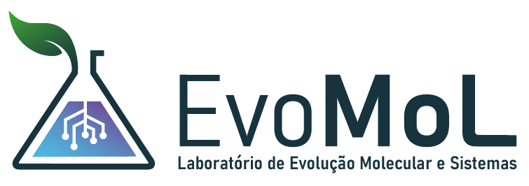
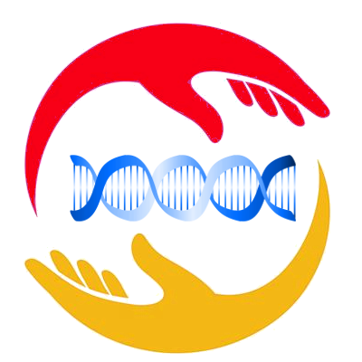
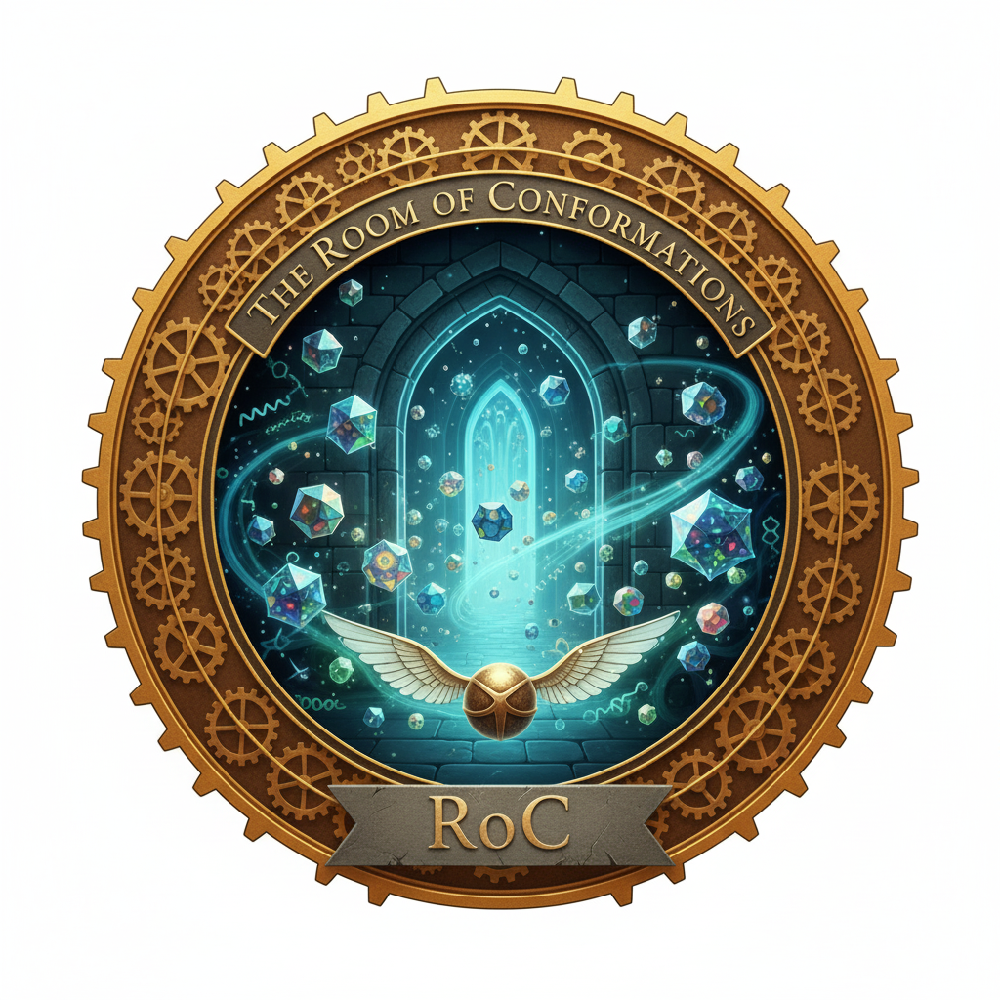
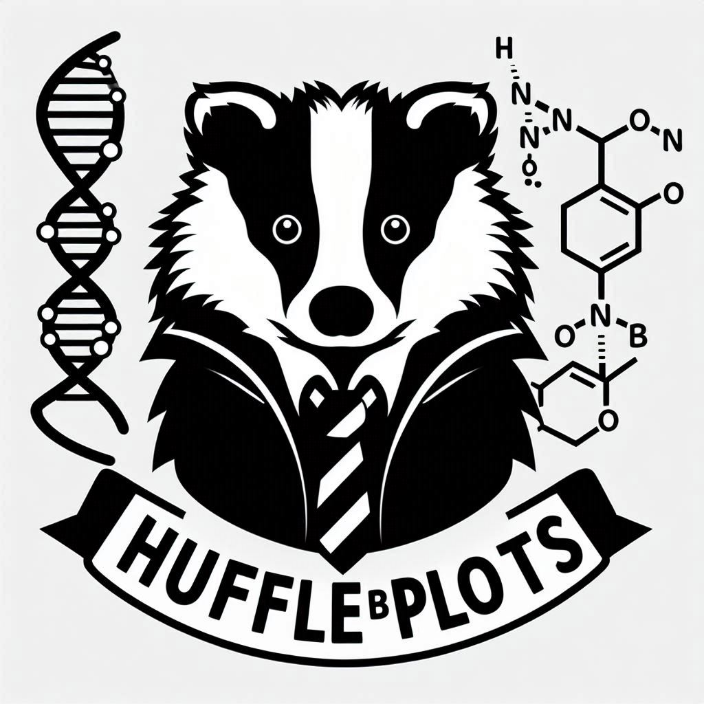
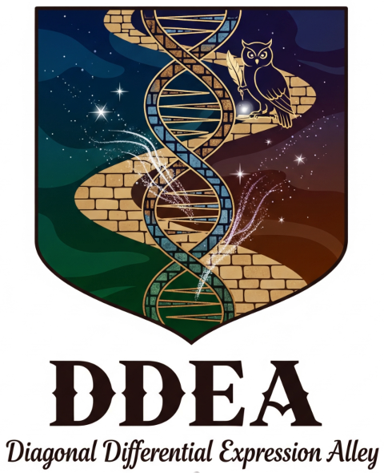
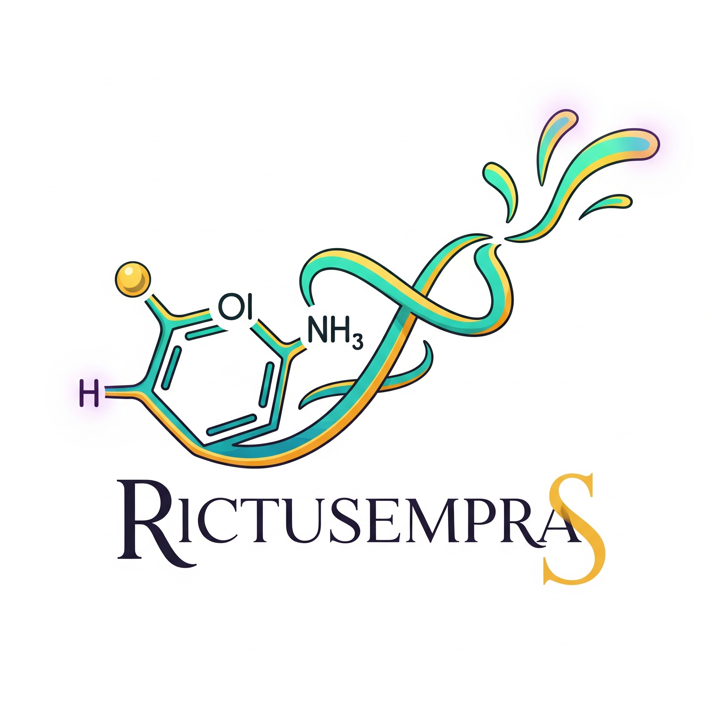
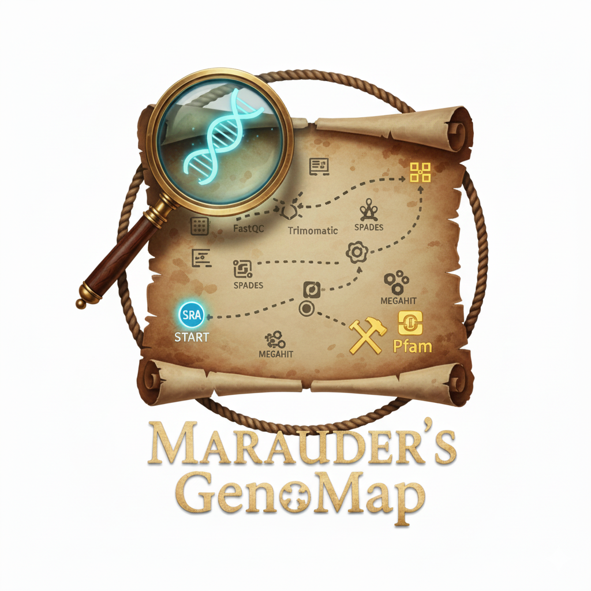

# Sobre el grupo:

## EvoMol-Lab

[EvoMol-Lab Home Page](https://evomol-lab.github.io/)

[EvoMol-Lab GitHub](https://github.com/evomol-lab)

[Linktree](https://linktr.ee/EvomolLab)

El Laboratorio de Evolución de Moléculas y Sistemas ([EvoMol-Lab](https://evomol-lab.github.io/)) es uno de los grupos de investigación asociados al [Centro Multiusuario de Bioinformática (BioME)](http://biome.ufrn.br), del [Instituto Metrópole Digital (IMD)](http://imd.ufrn.br) de la Universidad Federal de Río Grande del Norte ([UFRN](http://ufrn.br)). La misión de EvoMol-Lab es estudiar los procesos evolutivos que actúan sobre moléculas, complejos supramoleculares y sistemas (vías y redes de interacción) y los efectos estructurales y funcionales provocados por la variación genética, empleando enfoques de Bioinformática, modelado molecular y análisis evolutivo de secuencias. Su Investigador Principal es el Prof. João Paulo MS Lima, Profesor Titular de la UFRN.

## Nuestras herramientas:
 EvoMol-Lab cuenta con una serie de herramientas "mágicas" para ayudarte con tu trabajo y análisis.

### CaRinDB
CaRinDB is an interactive database designed to streamline cancer mutation research by integrating data from The Cancer Genome Atlas (TCGA) and advanced structural analysis tools, along with advanced effect predictions and molecular features such as Residue Interaction Networks (RINs) derived from Protein Data Bank experimental structures and AlphaFoldDB computational models. Covering 33 distinct cancer types, CaRinDB offers a broad spectrum of insights into cancer mutation dynamics.

[CaRinDB](https://bioinfo.imd.ufrn.br/CaRinDB/)

---

### SlyTheRINs: 
Un comparador de Redes de Interacción de Residuos (RINs) basado en parámetros de grafos. 

[SlyTheRins](https://slytherins.streamlit.app).

---

### The Room of Conformations (RoC)

A user-friendly desktop tool for generating all-atom protein conformational ensembles using Normal Mode Analysis.

[The Room of Conformations](https://github.com/evomol-lab/RoC)

[RoC - GoogleColab Version](https://colab.research.google.com/drive/1jd3qgAZPF9bWxlcCjYURpFQAEYW102Y5?usp=sharing)

---

### RevelioPlots 
Un evaluador para estructuras de proteínas producidas por predictores basados en IA. 

[RevelioPlots](https://revelioplots.streamlit.app).

---

### HufflePlots
Una herramienta sencilla para trazar gráficos interactivos de RMSD y RMSF a partir de Dinámica Molecular y simulaciones basadas en modo normal.

[HufflePlots](https://protplots.streamlit.app).

---

### Differential Expression Diagonal Alley (DDEA)
DDEA is a simple Streamlit application to analyze Case x Control gene expression output data from GEO. Allows users to upload a .tsv file, a custom gene list (optional), and specify a comparison string, with controls in a sidebar. DDEA then plots differentially expressed genes using Plotly and displays their p-values.

[DDEA](https://ddealley.streamlit.app/)

---

### *Rictusempra*
Una herramienta sencilla para visualizar estructuras químicas en formato SMILES.

[Rictusempra](https://rictusempra.streamlit.app)

---

### Marauder's GenoMap

A comprehensive pipeline for the discovery of protein families in de novo assembled genomes and transcriptomes.

[Marauder's GenoMap](https://github.com/evomol-lab/MaraudersGenoMap)

--- 

### The Pensieve Plotter
An interactive tool for visualizing Extended Bayesian Skyline Plots (EBSP) from BEAST log files.

[PensievePlotter](https://pensieveplotter.streamlit.app/)

---

## Acerca de mi:

### Profesional

Soy Biólogo (Licenciado) egresado por la Universidad Federal de Ceará (UFC) (2000), Especialista en Bioinformática (2002), Magíster (2003) y Doctor en Bioquímica (2007). He trabajado científicamente en las áreas de Bioquímica, Biología Molecular y Bioinformática. Mi principal línea de investigación en la actualidad es la Evolución de Moléculas y Vías Metabólicas, utilizando abordajes desde la Bioinformática/Bioinformática Estructural y Filogenia Molecular. Actualmente soy Profesor Titular del Departamento de Bioquímica, Centro de Biociencias de la Universidad Federal de Río Grande del Norte, miembro permanente del [Programa de Posgrado en Bioinformática (PPg-Bioinfo-IMD/UFRN), investigador (P.I.) del Centro Multiusuario de Bioinformática (CMB/IMD/UFRN)](http://bioinfo.imd.ufrn.br) e investigador asociado del Instituto de Medicina Tropical RN (IMT-RN).

- [CV Lattes](http://lattes.cnpq.br/3289758851760692)
- [Página Docente en la UFRN](https://docente.ufrn.br/201900369630/perfil) / [SIGAA](https://sigaa.ufrn.br/sigaa/public/docente/portal.jsf?siape=1513597)
- [OrcID](https://orcid.org/0000-0002-6113-8834)
- [ResearchGate](https://www.researchgate.net/profile/Joao-Lima-31)
- [LinkedIN](https://www.linkedin.com/in/jo%C3%A3o-paulo-ms-lima-b0667351/)
- [LinkTree](https://linktr.ee/jpmslima)

### Personal
Padre de humanos y de perros. Científico, ciclista aficionado, entusiasta del gravel.

Mastodon: [@jpmslima@mstdn.science](https://mstdn.science/@jpmslima)

