# Computational Representation of Biomolecules

The objective of this tutorial is to introduce concepts related to the computational representation and visualization of biological molecules, such as proteins, nucleic acids, small ligands, etc. It serves as visual support for understanding three-dimensional structures and the chemical bonds/interactions that stabilize them.

**Notes:**

- This tutorial was built ***for educational purposes only***. <span style="color:red">**Reproduction for any other purpose is not allowed or consented to.**</span>
- To optimize time, the tools/programs used here should already be installed on the machine. Browse the rest of the site to check the necessary steps for their installation.

***See also the audio-commented tutorial (automatically generated by Artificial Intelligence):***

<iframe
  src="https://drive.google.com/file/d/1NJhVgb-8Oo6rEI7woKalrN03GtbCpZyM/preview"
  width="300"
  height="60"
  frameborder="0"
  allow="autoplay; encrypted-media"
  allowfullscreen
></iframe>

**ATTENTION**

<span style="color:red">The audio above is only to assist with accessibility; it does not narrate all the steps. Listening to it does not replace executing the steps below, nor does it replace in-person classes with a professor/instructor.</span>

## Basics of Computational Molecule Visualization

### Nucleic Acids

Nucleic acids are informational molecules with a three-dimensional structure. This structure is uniform in the case of the double helix (DNA or RNA) or variable in the case of RNAs with biologically active secondary/tertiary structures. Information can be represented as simple characters, like a text file (plain text, not in a .doc). The most common representation of nucleotide or protein sequence information in Bioinformatics is the **fasta** format. It was developed by David J. Lipman and William R. Pearson in 1985, alongside a sequence similarity search program called [FASTA](https://pubmed.ncbi.nlm.nih.gov/2983426/), which was later replaced in many applications by [BLAST](https://blast.ncbi.nlm.nih.gov/Blast.cgi).

It begins with a description line preceded by `>`, followed by the sequence itself, without spaces or numbers. Its simplicity facilitates the manipulation and analysis of biological data. Below is an example of a nucleotide sequence in this format:

```fasta
>Sequence_1
TCTCGATGCAGCTAGCTATCGCAT
```
In the sequence lines, only canonical characters for nucleotides and amino acids are accepted, which can be checked [HERE](https://web.archive.org/web/20110811073845/http://www.dna.affrc.go.jp/misc/MPsrch/InfoIUPAC.html).

Copy the sequence above and paste it into a plain text document (using Notepad or gedit, on Windows and Linux OS, respectively).

#### Transforming into 3D Visualization

To transform this information into a 3D structure, we will use the program [UCSF ChimeraX](https://www.cgl.ucsf.edu/chimerax/) and follow these steps:

- Open ChimeraX.
- Upon opening, a screen similar to the one below should appear:

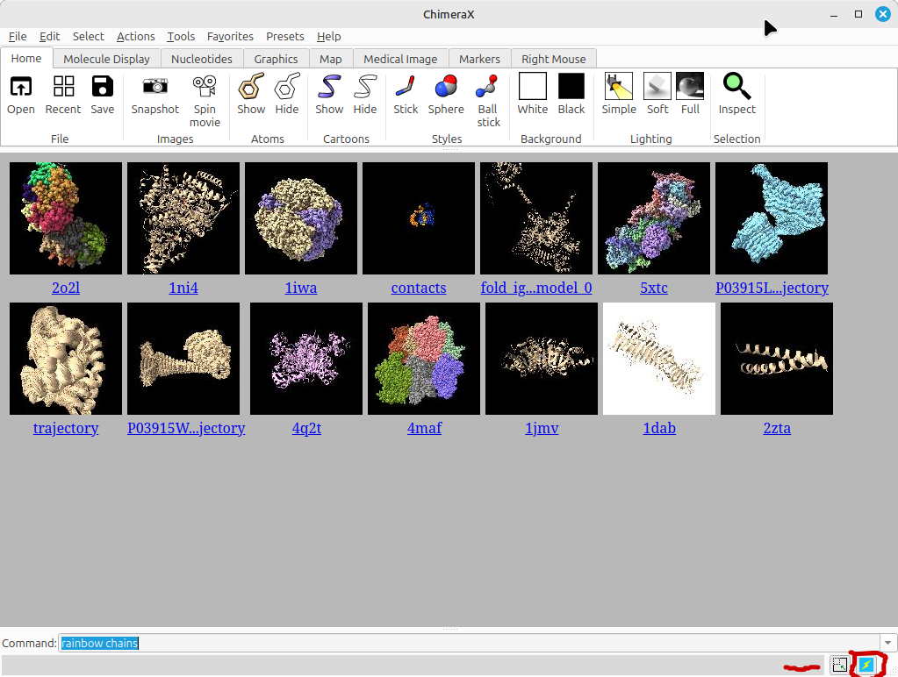

>*If a black screen appears, click the icon marked in the figure above.*

- Now, follow this path in the menu:
  - *Tools... Structure Editing... Build Structure*

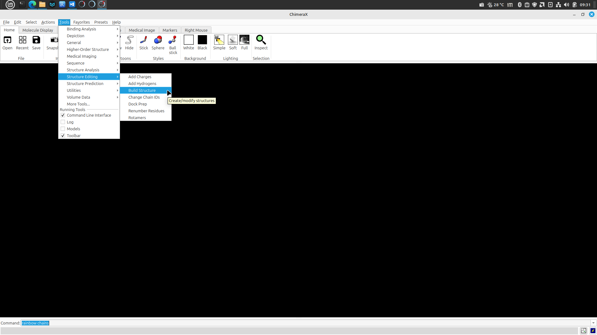

- A dialog box will appear in the sidebar. Click on *helical DNA/RNA* and paste the sequence described above into the box, keeping the *DNA* and *B-Form* options checked, as shown in the figure below:

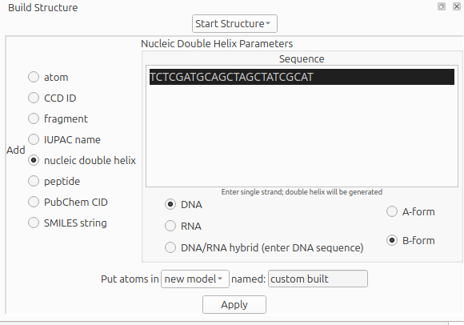

- Click `Apply`. Your molecule should appear.

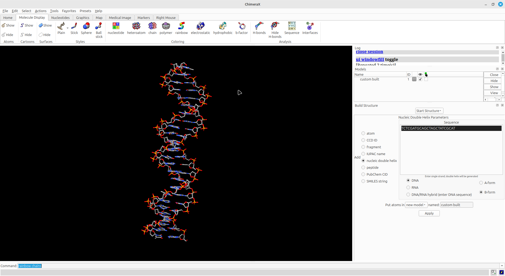

- Explore the molecule and its different representations by clicking on the *Molecule Display* tab above. These steps will be guided by the professor during the demonstration.

>*You can also use your own sequence or change the visualization form. For example, how about making a hybrid DNA/RNA double helix?*

- Let's save the molecule in another file format called `pdb`.
  - Go to *File* > *Save...* and save the molecule with the name `Seq1.pdb`.
- Now open this file in a text editor.
- Let's check its format.

## Representing Small Molecules

We will now use a simplified chemical notation called SMILES (*Simplified Molecular Input Line Entry System*), which serves to represent molecules and reactions.

> *More information about SMILES can be found [HERE](https://www.daylight.com/dayhtml/doc/theory/theory.smiles.html).*

From the [SMILES](https://www.daylight.com/dayhtml/doc/theory/theory.smiles.html) info site or via Google searches or chemical structure databases (like [PubChem](https://pubchem.ncbi.nlm.nih.gov)), look for the name and draw other molecules of interest. For example, let's visualize the structure of Rosuvastatin [Click here](https://pubchem.ncbi.nlm.nih.gov/compound/446157)?

- On the drug information page, look for the SMILES code, which will be in the "*Canonical SMILES*" field:

```
CC(C)C1=NC(=NC(=C1/C=C/[C@H](C[C@H](CC(=O)O)O)O)C2=CC=C(C=C2)F)N(C)S(=O)(=O)C
```
- This SMILES code can be used to build the molecule in the ```Build Structure``` dialog box of UCSF Chimera.

The PubChem ID for the Rosuvastatin molecule is 446157. In *File > Fetch by ID*, select the PubChem database and enter this code.

- Observe the representation of Rosuvastatin in different visualization types. Look for other molecules that interest you.

### Proteins

Proteins are also informational molecules, but with a larger "alphabet" of 20 proteinogenic amino acids (encoded in the genetic code), described in the figure below:

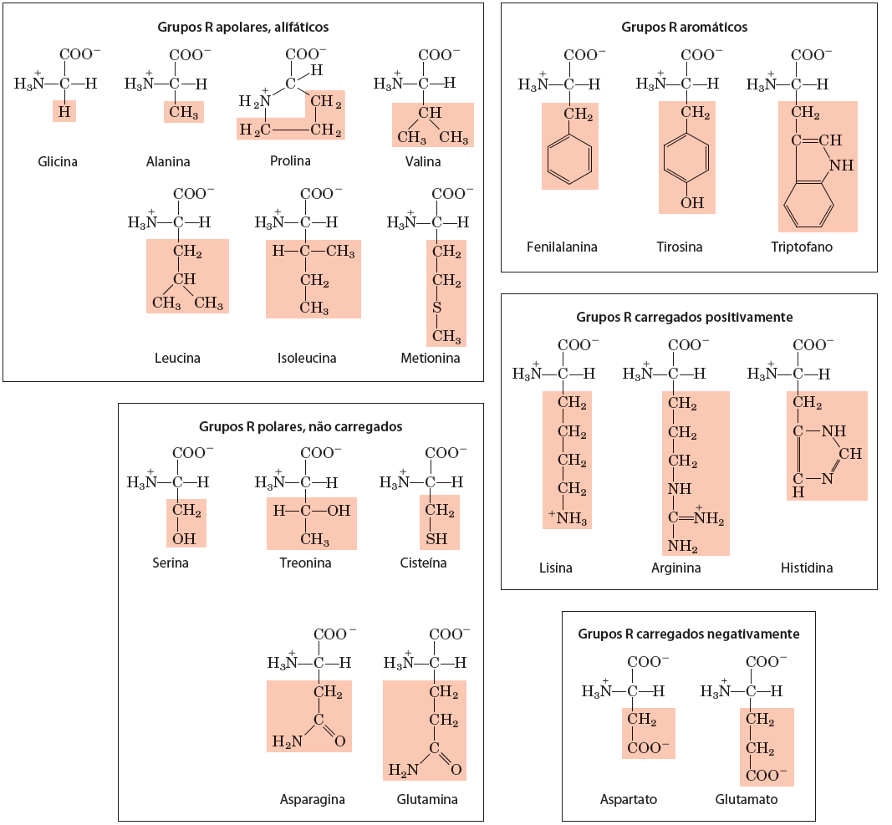

The table below summarizes the 1-letter and 3-letter codes for these amino acids:

| Amino Acid | 3-Letter Code | 1-Letter Code |
|:-------|:--:|:--:|
| Alanine | Ala | A |
| Arginine | Arg | R |
| Asparagine | Asn | N |
| Aspartate | Asp | D |
| Cysteine | Cys | C |
| Glutamate | Glu | E |
| Glutamine | Gln | Q |
| Glycine | Gly | G |
| Histidine | His | H |
| Isoleucle | Ile | I |
| Leucine | Leu | L |
| Lysine | Lys | K |
| Methionine | Met | M |
| Phenylalanine | Phe | F |
| Proline | Pro | P |
| Serine | Ser | S |
| Threonine | Thr | T |
| Tryptophan | Trp | W |
| Tyrosine | Tyr | Y |
| Valine | Val | V |

Later, you can see the individual formulas for all these amino acids using the ```Build Structure``` menu in UCSF Chimera, clicking on peptide and entering only one amino acid using the 1-letter code.

Primary structure information of proteins is also described in `fasta` format:

```
>Pep1
RDQ
```
### Verifying Rotation Angles

Now we will work with the peptide above (RDQ) to visualize the different possibilities of the rotation angles **ø** (*phi*) and **Ψ** (*psi*), and relate them to the [Ramachandran Plot](https://en.wikibooks.org/wiki/Structural_Biochemistry/Proteins/Ramachandran_Plot). To do this, follow the steps below:

- *Tools... Structure Editing... Build Structure*

In the window that appears, click on ```peptide``` and in the indicated space, enter **RDQ**.

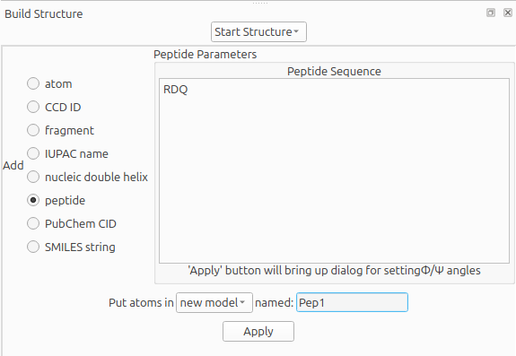

- In the ```named``` field, give the molecule a name or leave the default.
- Click `Apply`.

In the next window, check the **ø** (*phi*) and **Ψ** (*psi*) angles assigned by default to residue D (-57/-47). Click `Apply` again, but this time leave the window open. The first molecule will appear.

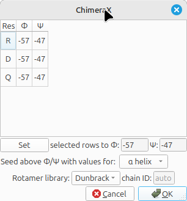

In this same window, you will change the rotation angles as follows:
- Select residue D and in the boxes below, enter 0 degrees for both *ø* and *Ψ* angles. Press the ```Set``` key, check if the angles for residue D have changed, and click `Apply`.

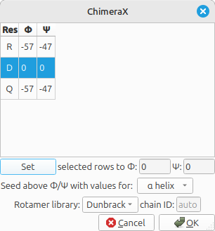

- Add H atoms for the 3 molecules as shown in class (*Tools > Structure Editing > Add Hydrogens*). Also change the visualization options to your favorite view.

The two molecules will appear overlapped. Click the `Right Mouse` tab in the main ChimeraX window, click *Drag Model*, and with the mouse pointer over one of the peptides, right-click and drag it elsewhere on the screen to avoid overlap.

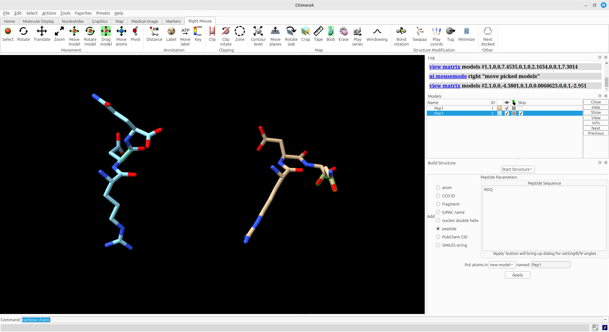

Check the overlaps between atoms caused by the different torsion angles around the peptide bond of residue D.

### Secondary Structures

Now let's open a full structure for the first time.

- Click *File > Fetch by ID*.
- In the window that appears, select the ```PDB``` database and type [1ZIK](https://www.rcsb.org/structure/1ZIK) in the field.

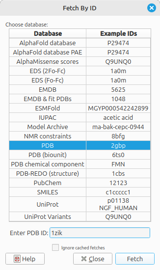

- Click `Fetch`.
- Move and observe the characteristics of this structure.

This protein is a leucine zipper formed by two peptides.

> *What is the main type of secondary structure in this protein?*

The default initial display is ribbons. To also display its atoms, click:

- *Actions... Atoms/Bonds... show*.

The command shows all atoms and bonds in the structure, except those in the peptide chain suppressed by the ribbon display. Initially, heteroatoms (atoms other than carbon) are color-coded by element: oxygen red, nitrogen blue, etc. Carbons retain the model color.

- Try moving the structure with the mouse in the main graphics window.

Now let's remove the ribbon visualization:

- *Actions... Ribbon... hide* (To show only the atoms).

Identify the amino acids, their side chains, and the peptide bonds.

Now select one of the chains of the 1ZIK structure and show the hydrogen bonds with the option:

- *Tools... Structure Analysis... H-Bonds*. In the next window, click `Ok`.

Observe the hydrogen bonds that stabilize the alpha-helix structure.

>*In ChimeraX, all the commands above can be performed by clicking the icons.*

Let's now analyze a structure that also has beta-sheets.

- Click *File > Fetch by ID*.
- In the window that appears, select the ```PDB``` database and type [5BVL](https://www.rcsb.org/structure/5BVL) in the field.
- Click `Fetch`.
- Move and observe the characteristics of this structure.

Let's visualize the secondary structure types differently in this structure:

- Go to the command line at the bottom of ChimeraX, type *color strand red* and press `ENTER`. The beta-sheets should now appear in red.

### Tertiary and Quaternary Structures

The primary structure of insulin is represented in the figure below:

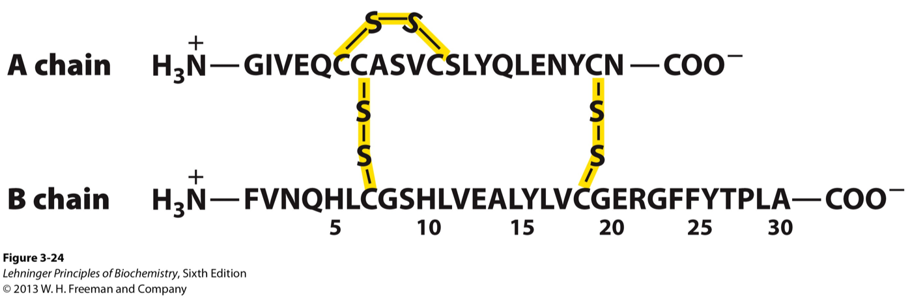

Now let's work with the tertiary structure of this hormone. Open the structure [1ZEH](https://www.rcsb.org/structure/1ZEH) as indicated above.

With it open, identify:

- The chains of the hormone insulin.
- The types of secondary structures involved.
- Obtain the Ramachandran plot.
- Visualize the H-bonds.
- Locate and visualize the disulfide bridges (S-S).
> *For this last item, the tip is to look for cysteines, according to the figure below.*

To check quaternary structures, we will download the structure of Human HMG-CoA Synthase in complex with Rosuvastatin. This structure is PDB [1HWL](https://www.rcsb.org/structure/1HWL). Follow the steps guided in class.

## Predicting the Effect of Modifications

From the [Uniprot](http://uniprot.org) access number (or entry name) of the protein, we will obtain information about automatic computational modeling and functional prediction of modifications in its sequence using [AlphaMissense](https://deepmind.google/discover/blog/a-catalogue-of-genetic-mutations-to-help-pinpoint-the-cause-of-diseases/). The Uniprot access number we will use is [P04035 · HMDH_HUMAN](https://www.uniprot.org/uniprotkb/P04035/entry). Click on this record to check the description of this protein.

- Open the [AlphaFoldDB](https://alphafold.ebi.ac.uk/) page.
- In the search field, enter the Uniprot access number or entry name and click `SEARCH`.
- Click on the result or go directly [HERE](https://alphafold.ebi.ac.uk/entry/P04035).

In the AlphaFoldDB record, you will see the modeled 3D structure, and below it, a graph with the functional impact prediction performed by [AlphaMissense](https://deepmind.google/discover/blog/a-catalogue-of-genetic-mutations-to-help-pinpoint-the-cause-of-diseases/). Each predicted modification (replacement of an amino acid by any of the other 19) at each site of the primary sequence can be observed in the graph, which describes the result in three categories: Benign (Blue), Likely Pathogenic (Red), and Uncertain effect (Gradient between blue and red). This scale reflects the AlphaMissense score (*am_score*), ranging from 0 (most benign) to 1 (most pathogenic).

## COSMIC-3D

[COSMIC-3D](https://cancer.sanger.ac.uk/cosmic3d/) is a database that integrates cancer-associated mutations with 3D structures of the human proteome. It is a very interesting base for visualizing the effect of mutations/polymorphisms on protein structure.

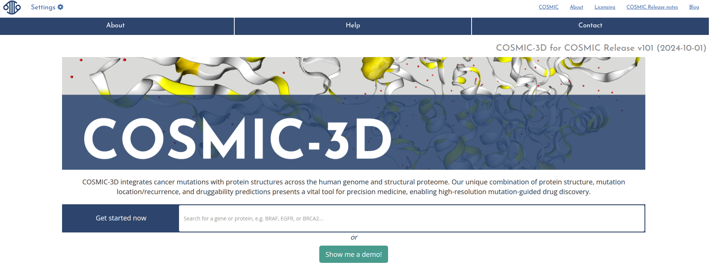

### Example of use:

We will use the FGFR2 gene by entering its symbol (GeneSymbol) in the search field. Below, a box with the protein's Uniprot code and the number of available structures appears. Press `ENTER`.

On the next page, you will see the protein structure and a graph summarizing the reported mutations, their structural coverage, and their frequency. By clicking on a mutation, the amino acid change is visualized on the structure.

- What is the impact of a mutation at position 376 of this protein?
- Does it have structural coverage?

The video below demonstrates searching for the EGFR gene:

<iframe src="https://drive.google.com/file/d/1pFc1kVYLBHkjd4zQZOcx61kXjuIapBVP/preview" width="640" height="480" allow="autoplay"></iframe>