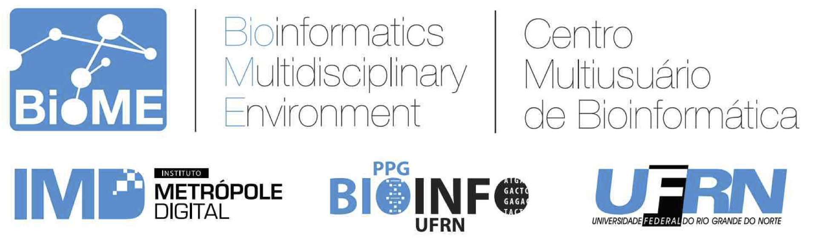

# BioinfoX

The goal of this page is to serve as a support resource for basic Bioinformatics practicals in undergraduate and graduate courses at UFRN. Here you can find the guidelines and files that will be used during classes and practical demonstrations.

## What is Bioinformatics?
Bioinformatics can be defined as the use of computers for the acquisition, management, and analysis of biological information. It exists at the intersection of molecular biology, computational biology, clinical medicine, database computation, the internet, and sequence analysis. Currently, bioinformatics plays a central role in modern biology, integrating data obtained from genome and proteome projects with experimental data from diverse fields such as enzymology, genetics, structural biology, and medicine. In its broadest sense, it includes the following aspects: knowledge management and expansion; data management and mining; support and projections of studies; data analysis; and determining the function of a specific gene or protein.

## Site Topics
- Initial Bioinformatics Tutorials.
- Phylogeny and Evolutionary Sequence Analysis Tutorials.
- Structural Bioinformatics Tutorials.

## ChimeraX Installation Script
